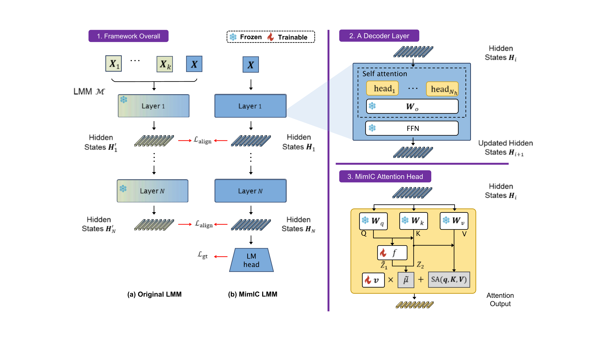

<h1 align="center">Mimic In-Context Learning for Multimodal Tasks</h1>

<p align="center">
<a href="">
</a>
</p>




**Mimic In-Context Learning (MimIC)** is a novel framework to adapt vision language models by approximating shift effects from in-context demonstrations. By integrating lightweight learnable modules int models, it demonstrates superior performance compared to previous shift-vector methods and LoRA.

## Setup
### 1. Create environment
The following command can help you build the environment for testing idefics1 and idefics2.
```bash
conda create -y -n mimic python=3.10
pip install -r requirements.txt
```
### 2. Specify the root path of your models and datasets in `config.py`
For models, we currently support idefics1, idefics2 and llava-next-interleave. For datasets, VQAv2, OK-VQA, COCO, hateful memes, MME, MMLU and SEED are available.

## How to Run
```bash
cd ./script
# select a bash file to run
bash run_*.sh 
```

## Code Reading Guides
We would like to introduce some key files to help you understand how MimIC works.
## [`shift_encoder.py`](./src/shift_encoder.py)
In this file, we implemented MimIC attention heads (`AttnApproximator`) and another vector-based method -- [LIVE](https://arxiv.org/pdf/2406.13185) (`AttnFFNShift`).

As we mentioned in paper, self-attention layers are substituted by MimIC attention heads. Such an integration is achieved by replacing `forward` of those self-attention layers in models (see `*_attn_forward` and `register_shift_hooks`). For example, as you can see `idefics_attn_forward`, we do a shift on regular attention output base on key and query of idefics.

In `do_shift` of `AttnApproximator`, we implemented $f(\cdot)$ and $\boldsymbol{v}$ to approximate in-context demonstrations affected terms (Section 3.2).

## [`shift_model.py`](./src/shift_model.py)
In this file, we implemented training framework of MimIC, as illustrated in Figure 3. `ShiftModel` feeds contexts prepared from `data_module.py` to the model and calculate losses depends on `model_strategy`. The `model_strategy` describes which types of losses should be calculated. For exmaple, MimIC uses `Strategy.LAYER_WISE_MSE` and `Strategy.LM_LOSS`, which stand for $L_{\text{align}}$ and $L_{\text{gt}}$ (Eq. 6), respectively. To train LIVE, `Strategy.LOGITS_KL_DIV` and `Strategy.LM_LOSS` are used. As to LoRA, only `Strategy.LM_LOSS` should be applied.

We firstly feed in-context demonstrations and query to model to capture hidden states $H^\prime$  from all layers. This is achieved by [`forward_hook`](https://pytorch.org/docs/stable/generated/torch.nn.modules.module.register_module_forward_hook.html), please see `register_record_hook` in `shift_encoder.py` for details. Then, we enable `shift_hook` (introduced in previous section) only feed query to model to obtain shifted hidden states $H$. Finally, layer-wise alignment loss is computed with these hidden states.

